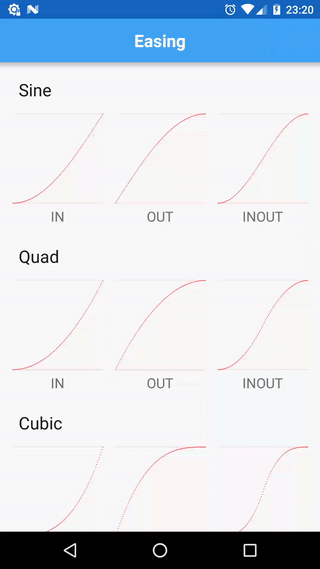

[](http://search.maven.org/#search|ga|1|g%3A%22ru.noties%22%20AND%20a%3A%22tumbleweed%22)
[](http://search.maven.org/#search|ga|1|g%3A%22ru.noties%22%20AND%20a%3A%22tumbleweed-android%22)

**Tumbleweed** is a fork of [Universal-Tween-Engine](https://github.com/AurelienRibon/universal-tween-engine) by [Aurelien Ribon](http://www.aurelienribon.com/). To quote the parent project:

> allows you to create smooth interpolations on every attribute from every object in your projects

 

**Tumbleweed** comes with few changes and differences:

* decreased mutation of Tweens and Timelines (split definition and execution of tweens)
* encapsulated interpolation by introducing specific type (`TweenType<T>`)
* removed pooling (a constant source of unexpected behaviour)
* fixed `Circ.IN` equation
* standalone module targeted on Android with a set of available TweenManagers for a `View`, `Drawable` and `Handler`; a set of predefined interpolated types: `color`, `alpha`, `translation`, `scale`, `rotation`, etc; a `TweenInterpolator` bridge in order to use equations with native Android `Animation` and `Animator`
* some utility methods and helpers


## Installation

```gradle
// base module
implementation 'ru.noties:tumbleweed:1.0.0`

// android module
implementation 'ru.noties:tumbleweed-android:1.0.0'
```

Both modules have no external dependencies except for `support-annotations`


## Usage

The API is pretty much the same:

```java
final View view = findViewById(R.id.view);
Tween.to(view, Translation.XY, 2.F)
        .target(0, 0)
        .ease(Cubic.INOUT)
        .start(ViewTweenManager.create(view));
```

Here `Translation.XY` is a predefined `TweenType<View>` (found in `ru.noties.tumbleweed.android.types.*` package) that applies translation X and Y.

`Cubic.INOUT` is predefined equation (found in `ru.noties.tumbleweed.equations.*`)

> Please note that all durations are measured in seconds, so `2.F` is `2 seconds`

```java
final View view = findViewById(R.id.view);
Timeline.createParallel()
        .push(Tween.to(view, Alpha.VIEW, 2.F).target(.0F))
        .push(Tween.to(view, Scale.XY, 2.F).target(.5F, .5F))
        .start(ViewTweenManager.create(view));
```


### Android predefined TweenTypes

`ru.noties.tumbleweed.android.types.*`:

---

* **Alpha.VIEW** (applies alpha to a View: `view.setAlpha(..)`). Range: `0.0-1.0`
* **Alpha.DRAWABLE** (`drawable.setAlpha(..)`, available for devices running KITKAT and up) Range: `0.0-1.0`
* **Alpha.PAINT** (`paint.setAlpha(..)`). Range: `0.0-1.0`

---

* **Argb.BACKGROUND** (`view.setBackgroundColor(..)`)
* **Argb.PAINT** (`paint.setColor(..)`)
* **Argb.TEXT_COLOR** (`textView.setTextColor(..)`)
* **Argb.STATUS_BAR** (`window.setStatusBarColor(..)`, available for devices running Lollipop and up)
* **Argb.COLOR_DRAWABLE** (`colorDrawable.setColor(..)`)


`Argb` also can be subclassed:
```java
public class MyObjectArgb extends Argb<MyObject> {
    @Override
    protected int getColor(@NonNull MyObject myObject) {
        return myObject.getColor();
    }

    @Override
    protected void setColor(@NonNull MyObject myObject, int color) {
		myObject.setColor(color);
    }
}
```

```java
Tween.to(myObject, new MyObjectArgb(), 2.F)
        .target(Argb.toArray(0xFFff0000))
        .start();
```

Please note that target color **must** be destructed to float[4] (argb values are interpolated individually). You can do it by calling: `Argb.toArray(int)` and `Argb.toArray(int, float[])`

---

* **Elevation.I** (`view.setElevation()`, available for devices with Lollipop with up)

---

* **Graphics.RECT** (interpolates `left`, `top`, `right` and `bottom` of a `Rect`)
* **Graphics.RECT_F** (interpolates `left`, `top`, `right` and `bottom` of a `RectF`)
* **Graphics.POINT** (interpolates `x` and `y` of a `Point`)
* **Graphics.POINT_F** (interpolates `x` and `y` of a `PointF`)

There is also special `Graphics.points(List<PointF>)` that creates interpolation for arbitrary list of `PointF`.

To receive a notification when rect or point have changed, the `action` method can be used:

```java
final View view = getView(); // obtain some view
final int width = view.getWidth();
final int height = view.getHeight();

final Rect start = new Rect(0, 0, width, height);
final Rect target;
{
    final int targetSide = Math.min(width, height) / 2;
    final int left = (width - targetSide) / 2;
    final int top = (height - targetSide) / 2;
    target = new Rect(left, top, left + targetSide, top + targetSide);
}

Tween.to(start, Graphics.RECT, 2.F)
        .target(target)
        .action(view::setClipBounds)
        .start(ViewTweenManager.create(view));
```

---

* **Pivot.X** (`view.setPivotX(..)`)
* **Pivot.Y** (`view.setPivotY(..)`)
* **Pivot.XY** (`view.setPivotX(..)`, `view.setPivotY(..)`)

---

* **Position.X** (`view.setX(..)`)
* **Position.Y** (`view.setY(..)`)
* **Position.Z** (`view.setZ(..)`, available for devices running Lollipop and up)
* **Position.XY** (`view.setX(..)`, `view.setY(..)`)
* **Position.XYZ** (`view.setX(..)`, `view.setY(..)`, `view.setZ(..)`, available for devices running Lollipop and up)

---

* **Rotation.I** (`view.setRotation(..)`)
* **Rotation.X** (`view.setRotationX(..)`)
* **Rotation.Y** (`view.setRotationY(..)`)
* **Rotation.XY** (`view.setRotationX(..)`, `view.setRotationY(..)`)

---

* **Scale.X** (`view.setScaleX(..)`)
* **Scale.Y** (`view.setScaleY(..)`)
* **Scale.XY** (`view.setScaleX(..)`, `view.setScaleY(..)`)

---

* **Translation.X** (`view.setTranslationX(..)`)
* **Translation.Y** (`view.setTranslationY(..)`)
* **Translation.Z** (`view.setTranslationZ(..)` available for devices running Lollipop and up)
* **Translation.XY** (`view.setTranslationX(..)`, `view.setTranslationY(..)`)
* **Translation.XYZ** (`view.setTranslationX(..)`, `view.setTranslationY(..)` and `view.setTransaltionZ(..)` available for devices running Lollipop and up)

---

These are just helpers and provided for faster iterations. They all implement the base `TweenType<T>` interface that is used by `Tween`:

```java
public interface TweenType<T> {

    int getValuesSize();

    void getValues(@NonNull T t, @NonNull float[] values);

    void setValues(@NonNull T t, @NonNull float[] values);
}
```

For example in case of `Translation.XY`:

```java
@NonNull
public static final Translation XY = new TweenType<View>() {
    @Override
    public int getValuesSize() {
        // we are interpolating x and y, so it's 2
        //
        // `getValues` and `setValues` methods will be called
        // with an array of the returned size
        return 2;
    }

    @Override
    public void getValues(@NonNull View view, @NonNull float[] values) {
        values[0] = view.getTranslationX();
        values[1] = view.getTranslationY();
    }

    @Override
    public void setValues(@NonNull View view, @NonNull float[] values) {
        view.setTranslationX(values[0]);
        view.setTranslationY(values[1]);
    }
};
```


### Android TweenManagers

#### ViewTweenManager

`ViewTweenManager` attaches to `View` draw cycle and invalidates it via `view.postInvalidateOnAnimation()`. It will be automatically disposed when a View to which it is attached to is detached from a window.

There are 2 factory methods to obtain it:
* `ViewTweenManager.create(View)` - will create new instance with each call
* `ViewTweenManager.get(int, View)` - will enforce only one instance per View per specified `int` (key). Internally it uses `View.setTag(int, Object)`.

As `View.setTag(int, View)` requires valid resource id, provided `int` must be one. `int` argument in `ViewTweenManager.get(int, View)` is annotated with `@IdRes` (as there is no generic `@ResourceId` annotation). In order to not be dependent on ids in your layout files, a standalone item can be created:

(`values/ids.xml` for example, but it can have any name, or you can place it inside any of your existing files)
```xml
<?xml version="1.0" encoding="utf-8"?>
<resources>

    <item name="tumbleweed_id" type="id" />

</resources>
```

So, you can initialize/retrieve `ViewTweenManager` like this:

```java
ViewTweenManager.get(R.id.tumbleweed_id, view);
```

---

#### DrawableTweenManager

`DrawableTweenManager` can be used with a `Drawable` (sample application heavily uses it).

To obtain an instance:
* `DrawableTweenManager.create(Drawable)`
* `DrawableTweenManager.create(Drawable, float)` - the second argument is update interval (FPS), default one is: `1.F / 60` (all durations are in seconds), so equals to 60 frames per second.

In order to function correctly `Drawable` **must** be attached to a View or have manually set `Drawable.Callback` (internally uses `invalidateSelf()` and `scheduleSelf()`)

---

#### HandlerTweenManager

`HandlerTweenManager` uses `Handler` as a dispatcher for update calls.

To obtain an instance:
* `HandlerTweenManager.create()` - creates an instance with main thread Looper and 60 updates per second (60 FPS)
* `HandlerTweenManager.create(float)` - creates an instance with main thread Looper and specified update interval (in seconds, so `1.F / 60` would be equal to 60 FPS)
* `HandlerTweenManager.create(float, Handler)` - creates an instance with specified Handler and update interval (in seconds)
